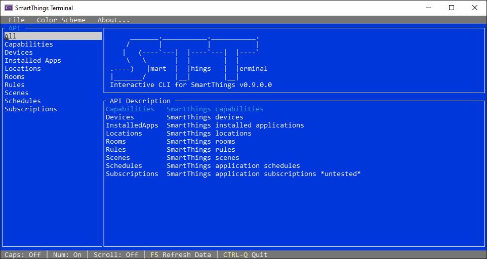
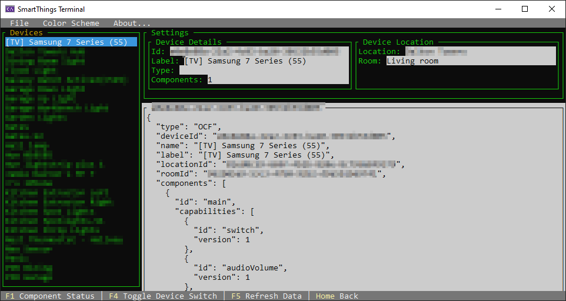

# SmartThings Terminal




# Overview

SmartThings Terminal is a cross platform CLI tool for the SmartThings API, providing a simple GUI terminal for navigating devices and settings within your SmartThings environment.  The functionality of this CLI is driven by the supporting [SmartThingsNet](https://github.com/daltskin/SmartThingsNet) dotnet sdk, which uses the underlying [SmartThings API](https://smartthings.developer.samsung.com/docs/api-ref/st-api.html). This tool is aimed at the SmartThings developer ecosystem and the curious to get quick insight into their smart home environments.

# Features



This CLI tool has the following features:

| Screen | View | Import | Run commands | Edit | Save | Copy | Delete |
| ------ | ------ | ------ | ------ | ------ | ------ |------ |
|Devices | * | | Toggle devices on/off | | | |
|Installed Applications| * | |  | | | |
|Locations | * | | | * | * | * | * |
|Rooms | * | | | * | * | * | * | 
|Rules | * | * | | * | * | * | * | 
|Scenes| * | | Run scenes | | | |
|Schedules| * | | |  | | * | * |
|Subscriptions| * | | | | | * | * |

# Hotkeys

Hotkeys are dependant on the selected screen:

* F1 Device component status
* F2 Import
* F4 Toggle device switch on/off
* F3 Edit
* F4 Save
* F5 Refresh - refresh data at any point
* F6 Copy
* F9 Delete (use with caution**)
* Home - Back to menu screen
* CTRL-Q - Quit

# Usage

Either clone the repo, or simply download the latest executable binaries version for your operating system from [releases](https://github.com/daltskin/SmartThingsTerminal/releases)

Simply run from your command prompt providing your access token.  If you don't have an access token, it's easy to set one up here: https://account.smartthings.com/tokens

***WARNING: Whilst there is some validation to stop corrupting your SmartThings environment configuration, you use this tool at your own risk.  Delete commands are unreversable - so ensure you know what you doing.*


## Command line

Using the -t (or --accesstoken) argument, provide your personal access token from the above into the STT  tool eg:

```bash
$ ./STT -t {accesstoken}
```


Alternatively, you can jump straight into a specific screen by providing the screen name using the -s (or --screen) argument using one of the following values:

| devices | installedapps | locations | rules | scenes | schedules | subscriptions |

eg:

```bash
$ ./STT -t {accesstoken} -s devices
```

# Functionality

* View Devices
  * View all of the registered devices
  * View device components status
  * Toggle lights/switches on/off
* Install Applications
  * View details of installed applications
* Locations
  * View the different location details
  * Edit/Update location details
  * Copy locations
  * Delete locations
* Rooms
  * View the rooms in all locations
  * Edit/update room details
  * Copy rooms
  * Delete rooms
* Rules
  * View rules
  * Edit rules
  * Copy rules
  * Delete rules
  * Import rules (from a json file in the current directory)
* Scenes
  * View scene details
  * Run scenes
* Schedules 
  * View integration schedules
  * Copy schedules (untested)
  * Delete schedules (untested)
* Subscriptions (untested)
  * View integration notification events
  * Copy subscriptions
  * Delete subscriptions

# Credits

This uses [Miguel de Icaza's](https://github.com/migueldeicaza) [console-based user inteface toolkit](https://github.com/migueldeicaza/gui.cs). Which, at the time of writing, is undergoing a substantial overhaul - hence the local project reference.

This also uses the [CommandLineParser](https://github.com/commandlineparser/commandline) project for manipulating command line arguments.